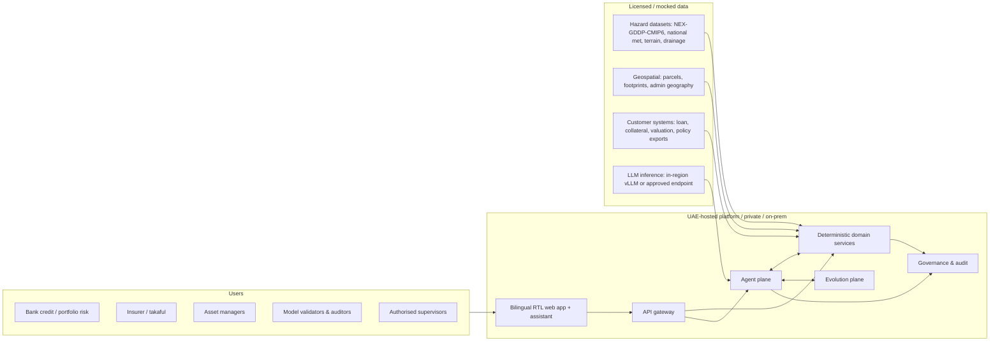
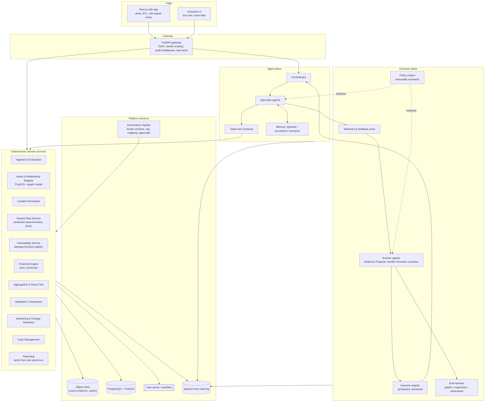
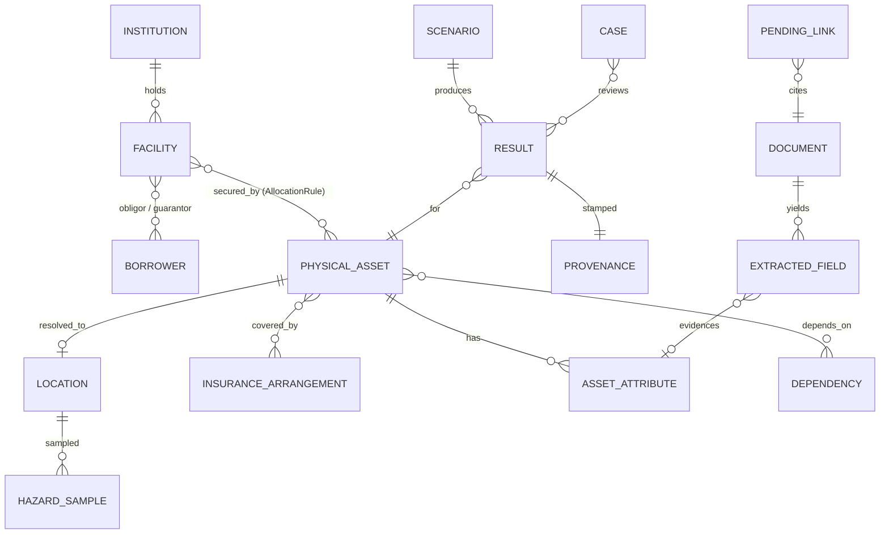
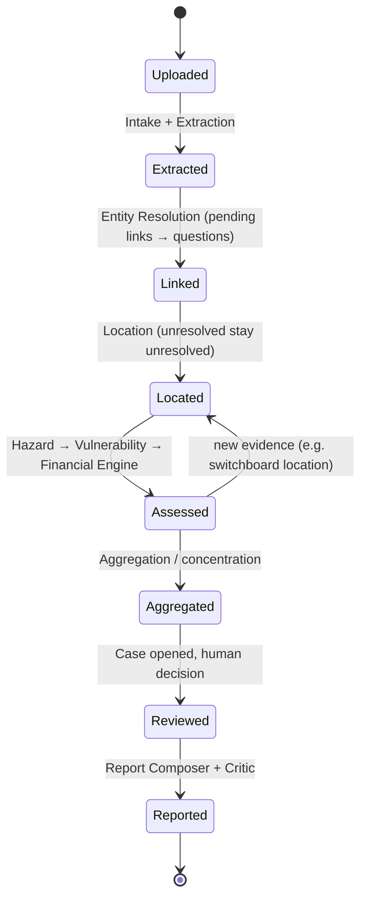
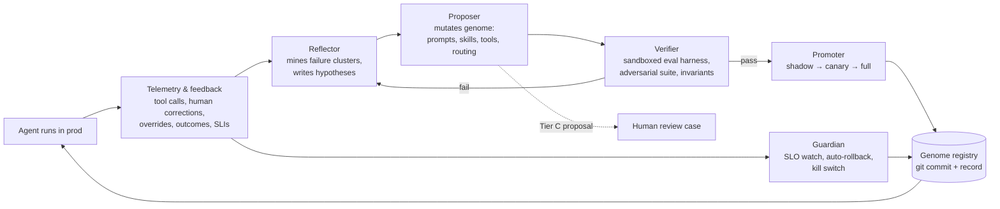
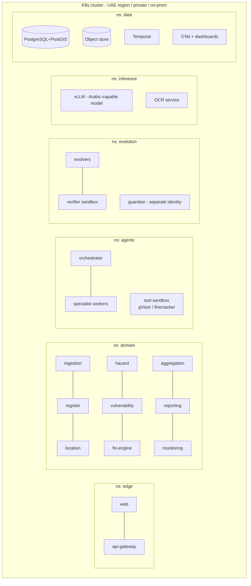

# UAE Climate Financial Risk Intelligence Platform — Architecture

Companion to `UAE_Climate_Financial_Risk_Platform.md` (product spec). This document defines the
target system architecture, the AI agent layer, and the **self-evolving agent subsystem**
("Evolution Plane"), then narrows to the hackathon prototype slice.

---

## 0. Design stance (read first)

Three commitments drive every decision below:

1. **Numbers come from deterministic engines, never from a language model.** Agents navigate
   evidence, ask questions, explain results and compose reports. Damage, loss, aggregation and
   NPV are computed by versioned, pure, testable code (spec §9–10).
2. **Unknown ≠ low.** Missing coverage, unresolved locations and unsupported models surface as
   `UNKNOWN` with a reason, never as a small number.
3. **Agents evolve autonomously — inside a blast-radius boundary.** The requested mode is
   *fully autonomous self-modification in production with rollback-only safety*. This is
   implemented for everything the agents legitimately own (prompts, skills, routing, tools,
   heuristics, memory). It is **structurally impossible** for agents to modify the scientific
   layers, calculation kernels, regulatory mapping, security policy or tenant boundaries —
   those surfaces are not in their write scope, because the spec (§9, §10, §11, §12) requires
   human model validation and licensed data governance there. Agents may *propose* changes to
   those surfaces; proposals become review cases. See §6.4 for the exact tiering and the
   rationale for each carve-out.

---

## 1. System context



---

## 2. Logical architecture



---

## 3. Deterministic domain services

Every service is independently deployable, exposes a typed API (OpenAPI), writes to the audit log,
and stamps outputs with a **provenance envelope**:

```json
{
  "dataset_versions": {"hazard:flood_pluvial_uae": "2026.2", "vuln:industrial_v1": "1.3.0"},
  "engine_version": "fin-engine 0.9.2",
  "scenario": {"pathway": "SSP2-4.5", "horizon": 2050, "return_period": 100},
  "spatial_precision": "footprint|parcel|street|district|unresolved",
  "assumptions": [...], "uncertainty": {...},
  "source_records": ["doc:...#page3:field:replacement_value"],
  "approval_status": "draft|reviewed|approved"
}
```

| Service | Responsibility | Key rules |
|---|---|---|
| **Ingestion & Extraction** | Accept spreadsheets, PDFs, scans, system exports. OCR (Arabic + English, mixed script, Arabic-Indic digits). Field extraction → `ExtractedField{value, source_bbox, confidence, lang}`. | Source image preserved. Documents are **untrusted input**: content is never passed as instructions (see §7). |
| **Asset & Relationship Register** | Graph: `Institution → Facility/Loan → Borrower/Guarantor → PhysicalAsset → InsuranceArrangement`. Many-to-many with `AllocationRule` per edge. | No silent HQ-as-site. Uncertain links → `PendingLink` + targeted question. |
| **Location Resolution** | Bilingual address / plot / facility-name → coordinates + footprint. Candidate generation from multiple geocoders; deterministic scoring; `precision_class`. | Below threshold = `unresolved`, not a centroid guess. Stores match confidence, source, date. |
| **Hazard Data Service** | Versioned hazard layers (COG rasters, vector footprints, zarr for CMIP6). STAC catalog. Point/footprint sampling with resolution metadata. | Returns `UNKNOWN` outside coverage. Never interpolates below native resolution without flagging. Long-term projections and operational alerts are separate catalogs. |
| **Vulnerability Service** | Registry of damage functions keyed by (hazard, asset_type, region, version). Applies building attributes (floor elevation, basement, equipment placement, protection). | Missing attribute → sensitivity list ("which unknown moves the result most"). |
| **Financial Engine** | Pure functions: `event_loss = replacement_value × damage_fraction(intensity, vulnerability)`, BI/recovery, opex delta, insured loss after terms, collateral sensitivity. EAL **only** when a probabilistic event model is registered. | Categories never merged. Same inputs ⇒ identical outputs in ar/en. Property-tested. |
| **Aggregation & Stress Test** | Group by borrower / emirate / sector / asset type / hazard / maturity / shared dependency. Event-footprint co-occurrence, not sum-of-worst-cases. Baseline vs stress vs protected. | Scenario definition stored as immutable object; reproducible by ID. |
| **Adaptation Comparison** | Measure library (cost, maintenance, assumed effectiveness); avoided loss, residual risk, NPV/payback only when inputs exist; sensitivity output. | Output labelled "prioritisation input, not certification". |
| **Monitoring & Change Detection** | Watches register, hazard and engine versions; recomputes affected records; diff classifier: `data_correction` vs `new_risk_signal` vs `model_change`. | Emits `Finding` events consumed by cases and by the Evolution plane. |
| **Case Management** | Case{owner, evidence_request, deadline, decision, audit}. Checkpoints: origination, renewal, portfolio review, capital planning. | Consequential decisions require human approval; agents cannot close cases. |
| **Reporting** | One structured result tree → ar/en briefs, portfolio reviews, scenario reports, model docs. Expert glossary. | Separate columns for outstanding exposure / physical damage / insured loss / modelled lender loss. Never labelled "official submission". |
| **Governance Registry** | Model & dataset versions, validation status, regulatory-mapping versions (jurisdiction, date), role definitions. | Human-owned. Agents have read access and proposal-write only. |

### 3.1 Core data model (abridged)



---

## 4. Agent plane

### 4.1 Principles

- Agents are **stateless workers over typed tools**. Every tool has a Pydantic input/output
  schema; the runtime rejects free-text tool calls.
- Agents **cannot emit** coordinates, probabilities, monetary values or citations except by
  copying a tool result by reference (`ref: result://…`). The policy engine (§6.5) validates
  every outbound message against this rule with a structured-output check plus a numeric-claim
  detector; violations are blocked and logged as `HALLUCINATION_ATTEMPT` telemetry.
- Each agent's behaviour is defined by a **genome** (§6.2) loaded from the Genome Registry at
  run start, so evolution changes take effect without redeploying code.

### 4.2 Specialist agents

| Agent | Purpose | Tools (examples) |
|---|---|---|
| **Orchestrator** | Routes user goals to specialists, maintains investigation state machine (scattered portfolio → defensible case). | `plan`, `dispatch`, `checkpoint` |
| **Intake** | Classifies uploaded documents, detects language/script, proposes a parsing plan. | `classify_document`, `detect_layout` |
| **Extraction** | Drives OCR/extraction, reconciles conflicting fields, flags low confidence. | `ocr_page`, `extract_fields`, `compare_fields` |
| **Entity Resolution** | Proposes borrower/asset matches across Arabic names and transliterations, using identifiers first. | `search_register`, `score_match`, `create_pending_link` |
| **Location** | Orchestrates geocoding candidates, chooses precision class, asks for disambiguation. | `geocode_candidates`, `sample_footprint`, `set_precision` |
| **Evidence-Gap** | Computes which missing attribute most changes results; formulates one targeted bilingual question at a time. | `sensitivity_rank`, `ask_user` |
| **Analyst / Explainer** | Bilingual assistant grounded in results; answers "which properties are most exposed…" with basis, uncertainty and record links. | `run_scenario`, `aggregate`, `explain_result`, `cite` |
| **Report Composer** | Fills bilingual report templates from the result tree; enforces column separation and glossary terms. | `render_report`, `glossary_lookup` |
| **Critic** | Adversarial second pass on any user-facing output: checks unknown≠low, category separation, citation integrity, ar/en numeric parity. | `verify_output`, `diff_ar_en` |

### 4.3 Investigation state machine



### 4.4 Memory

| Type | Content | Scope | Evolves? |
|---|---|---|---|
| **Episodic** | Past runs, corrections, overrides for this tenant | Tenant-isolated | Yes, per tenant |
| **Procedural** | Skills, heuristics, question templates, matching strategies | Tenant by default; promoted to shared only if derived from synthetic/public data or tenant has opted in | Yes — this is the main evolution target |
| **Semantic** | UAE geography, glossary, hazard/dataset descriptions, regulatory mapping | Shared, human-owned for glossary/regulatory | Read-only for agents |

---

## 5. Why "self-evolving" is worth building here

The economically important failures in this product are not maths errors; they are workflow
failures: an Arabic valuation report layout the extractor has not seen, a transliteration
pattern that breaks matching, a plot-reference format from one emirate, a question asked in the
wrong order so the analyst gives up. These are exactly the surfaces where an agent that learns
from every correction outperforms a static prompt — and they are surfaces where a mistake is
recoverable (a wrong match becomes a pending link; a bad question wastes a minute).

So the evolution loop targets **investigation efficiency and accuracy**, measured by the spec's
own success measures (§14): location-match accuracy, unresolved-record rate, extraction
accuracy per language, evidence traceability, time-to-reviewed-assessment.

---

## 6. Evolution plane (self-evolving agents)

### 6.1 Loop



The loop runs continuously (scheduled + event-triggered on failure clusters). No human is in
the loop for Tier A/B changes; humans are *notified* with a diff and can veto after the fact.

### 6.2 The genome

Each agent has a versioned, git-backed genome directory:

```
evolution/genome/<agent>/
  v0042/
    system_prompt.ar.md
    system_prompt.en.md
    skills/                # markdown skill files with triggers + procedures
    routing.yaml           # which tools/skills apply to which situations
    tools/                 # agent-authored Python tools (sandboxed; see 6.4)
    examples/              # few-shot cases mined from corrections
    evaluators/            # agent-authored evaluators (Tier B)
    manifest.json          # hash, parent version, eval scores, promotion state
```

A genome version is immutable. Promotion = pointer move. Rollback = pointer move back. The
runtime loads the active pointer per (tenant, agent); tenants can pin versions.

### 6.3 Evolver agents

| Evolver | Trigger | Output |
|---|---|---|
| **Reflector** | Nightly + on failure-cluster threshold (e.g. override rate on `Entity Resolution` > 8% for one document family) | `Hypothesis{failure_signature, suspected_cause, evidence_ids, target_component}` |
| **Proposer** | Hypothesis | Candidate genome version: prompt edits, new/edited skill, new sandboxed tool, routing change, new eval case. Multiple candidates per hypothesis (population of 3–5). |
| **Verifier** | Candidate | Runs full eval harness in an isolated sandbox with synthetic + consented data. Must not regress any golden metric; must pass adversarial suite and invariant checks. Produces scorecard. |
| **Promoter** | Passing candidate | Shadow mode (runs alongside active, no user-visible effect) → canary (5% of runs, one tenant if pinned) → full. Each stage gated on live SLIs, not just offline evals. |
| **Guardian** | Always on | Watches SLIs per genome version; auto-rollback on breach; hard kill switch per agent; freezes evolution if three consecutive rollbacks. Not itself evolvable. |

Evolvers are ordinary agents with their own genomes — *they evolve too* (Tier B), except the
Guardian and the policy engine.

### 6.4 Autonomy tiers (blast-radius boundary)

| Tier | Surfaces | Autonomy | Why |
|---|---|---|---|
| **A — fully autonomous in prod, rollback-only** | System prompts, skills, few-shot examples, question templates, routing policies, retrieval strategies, extraction heuristics, geocoder candidate weighting, agent-authored tools that run in the sandbox and call only existing typed APIs | Propose → verify → promote with no human gate. Humans notified with diff. | Failures are recoverable, visible and measurable; this is where learning pays. |
| **B — autonomous with shadow validation + signed change record** | Entity-matching scoring rules, evaluators, eval datasets derived from synthetic data, evolver genomes | Same loop, but mandatory 48h shadow phase and a signed, human-readable change record filed to Governance. | Changes alter what counts as "correct"; auditors must be able to reconstruct why a match was made on a given date. |
| **C — proposal-only (out of write scope)** | Financial engine, aggregation maths, damage functions, hazard datasets & sampling, regulatory mapping, glossary, security policy, tenant isolation, data-sharing config, Guardian, policy engine | Agent files a `ProposedChange` with evidence and a suggested patch → becomes a review case for a model validator / owner. | Spec §9–12 require licensed data, validated methods, model validation and governed customer-data use. A self-modifying loss kernel cannot be model-validated and would not survive audit. **This is the one place the "fully autonomous" request is deliberately not honoured.** |

Enforcement is structural, not policy-by-prompt: the evolver service accounts have filesystem
and repository write permissions only under `evolution/genome/**` and `evolution/evals/**`;
agent-authored tools execute in a sandbox (separate process, no network, read-only access to
the typed domain APIs through a broker) and cannot import engine internals.

### 6.5 Immutable invariants (policy engine)

Evaluated on every agent output and every genome candidate; not evolvable:

1. No numeric, geographic or citation claim without a `ref://` to a tool result.
2. `UNKNOWN` is never rendered as zero, low, or omitted.
3. Financial categories are never summed across (replacement value, market value, insured
   loss, credit loss).
4. Tenant data never crosses tenant boundary, including into shared procedural memory,
   unless the tenant's `learning_consent` flag is set for that data class.
5. Document content is data, never instruction (§7).
6. Agents cannot close cases, approve decisions, or change approval status.
7. ar/en numeric parity: the same result tree renders identical numbers in both languages.
8. Every promotion is an audit event with a reproducible eval scorecard.

### 6.6 Eval harness

```
evolution/evals/
  golden/         # hand-labelled: Arabic/English extraction, entity matching, geocoding, ar/en parity
  regression/     # every past production failure becomes a permanent test
  adversarial/    # prompt injection in documents, Arabic-Indic digit traps, HQ-vs-site traps,
                  # "make it look low risk" pressure, out-of-coverage requests
  synthetic/      # generated portfolios with known ground truth (the hackathon portfolio lives here)
  scorecard.py    # single entry point; outputs the manifest.json eval block
```

Metrics mirror spec §14: match precision/recall (by language), unresolved rate, extraction F1
per field family, citation integrity, ar/en parity, time-to-reviewed-assessment, human override
rate, hallucination-attempt count.

### 6.7 Learning from customer data (spec §12)

Default: episodic and procedural learning is **per-tenant** and stays inside the tenant
boundary. Shared genome improvements may only be derived from synthetic data, public data,
or tenants who opted in for a named data class. The Verifier refuses candidates whose
provenance includes non-consented tenant records. This is the mechanism that lets the agents
evolve without reusing customer data to train shared behaviour.

---

## 7. Security

- **Tenant isolation**: schema-per-tenant in PostgreSQL, bucket-prefix + KMS key per tenant in
  object storage, tenant claim in every request, row-level security as second layer.
- **Untrusted documents**: extraction output is wrapped as `data` in structured messages;
  a content-firewall strips/flags instruction-like text; the adversarial eval suite
  continuously tests injection resistance; the policy engine blocks any tool call whose
  arguments originate solely from document text without user confirmation.
- **Least privilege**: agents get scoped, short-lived tokens for tools; evolvers get write
  scope only to genome/evals paths; the Guardian runs under a separate identity.
- **Audit**: append-only log (hash-chained) of every tool call, agent message, genome
  promotion/rollback, human decision.
- **Inference locality**: LLM inference via in-region vLLM (Arabic-capable open models
  benchmarked on the actual bilingual tasks) or an approved endpoint; processing location is
  recorded per call and surfaced in governance views.
- **Retention & backups** follow tenant contract; logs redact extracted PII.

---

## 8. Technology choices

| Concern | Choice | Rationale |
|---|---|---|
| Backend language | Python 3.12 | Geospatial/climate ecosystem (rasterio, xarray, zarr, GeoPandas, Shapely), OCR tooling, agent frameworks. |
| API | FastAPI + Pydantic v2 | Typed contracts double as agent tool schemas. |
| Database | PostgreSQL 16 + PostGIS | Spatial joins, RLS, schema-per-tenant. |
| Raster/climate storage | COG + Zarr on S3-compatible object store (MinIO on-prem, or UAE-region object storage) with a STAC catalog | Versioned, cloud-native, resolution metadata built in. |
| Workflows | Temporal (or Prefect for prototype) | Durable multi-step investigations, retries, human-wait steps. |
| Agent runtime | Pydantic-AI or LangGraph (decide after a 1-day spike on structured-output reliability with the chosen Arabic model) | Both support typed tools and graph-style control; the key requirement is strict structured outputs. |
| LLM | Self-hosted via vLLM; candidates benchmarked on the eval harness (Arabic extraction, matching, explanation). Keep the provider swappable behind one interface. | Spec §10: benchmark on real bilingual tasks, verify processing location. |
| OCR | Layout-aware OCR with Arabic support (evaluate open-source engines vs. licensed); keep an adapter interface | Arabic scanned documents are a known weak spot; must be measurable and replaceable. |
| Frontend | Next.js (App Router) + a component library with real RTL support; i18n with ICU messages; bidi-safe number formatting | Complete RTL layouts, mixed-script tables and charts. |
| Reports | Structured result tree → templates → PDF/DOCX (WeasyPrint / docx) | Same tree renders both languages. |
| Policy engine | OPA/Rego or Cedar for invariants + a Python output validator | Declarative, auditable, not modifiable by agents. |
| Genome registry | Git repository + metadata table | Immutable versions, diffs, blame, rollback for free. |
| Deployment | Kubernetes (UAE-region managed, private, or on-prem); Helm charts; everything runs air-gap-capable | Spec §6 deployment options. |
| Observability | OpenTelemetry → in-region collector; per-genome-version SLI dashboards | Guardian input. |

---

## 9. Deployment topology



Network policy: `agents` and `evolution` namespaces can reach `domain` only through the
gateway's internal tool broker; `evolution` has no route to tenant object buckets except
through the Verifier's consented-data view.

---

## 10. Prototype slice (TDRA hackathon)

Goal (spec §8, §13): fictional portfolio — manufacturer, distributor, warehouse operator —
different sectors, same illustrative flood footprint; link, discover shared exposure, answer
one evidence-gap question, compare one protective measure, export a bilingual brief. Clearly
labelled synthetic inputs throughout.

### 10.1 What to build

| Layer | Prototype form |
|---|---|
| Web | Next.js, ar/en toggle, RTL verified on: review screen (confirmed/unresolved counts, concentration map, changes since last run, open questions), assistant panel, brief preview. |
| API | Single FastAPI app (modular monolith mirroring the service boundaries; split later). |
| Data | Docker Compose: PostgreSQL+PostGIS, MinIO. Synthetic portfolio CSV + 3–4 fake ar/en "valuation" PDFs in `data/synthetic/`. |
| Hazard | One labelled synthetic flood-depth raster (COG) with an explicit "illustrative scenario" badge; STAC item with version + resolution. Optional: NEX-GDDP-CMIP6 heat indicator at 25 km shown at *district* precision only, to demonstrate resolution honesty. |
| Vulnerability | 2 damage functions (industrial building, equipment) with the basement/above-ground switchboard attribute changing the fraction. |
| Financial engine | Event loss, BI (days × daily revenue assumption), insured loss after deductible/limit, collateral sensitivity. No EAL (no probabilistic model → shown as `UNKNOWN: no event-frequency model registered`). Property tests + ar/en parity test. |
| Aggregation | Group by borrower/sector + shared-footprint co-occurrence view. |
| Adaptation | One measure (flood barrier / raised equipment): cost, assumed effectiveness, avoided loss, residual risk, payback if inputs present. |
| Reporting | One bilingual review brief (HTML → PDF) with separated columns. |
| Agents | Intake+Extraction, Entity Resolution+Location, Evidence-Gap, Analyst, Critic. Orchestrator as a simple state machine. |
| Evolution v0 | Telemetry capture; genome registry with 2 agents versioned in git; eval harness with ~30 golden cases + 10 adversarial; Reflector→Proposer→Verifier→Promoter running end-to-end for **Tier A only**; Guardian as an SLI check + rollback CLI. Demo: correct one bad Arabic transliteration match → next nightly run produces a new Entity-Resolution genome version that passes evals and is promoted, with the diff shown in the governance view. |
| Governance view | Model/dataset versions, genome versions with scorecards, audit trail for the demo run. |

### 10.2 Demo sequence

1. Upload portfolio → 3 borrowers, 3 facilities, 2 unresolved (one HQ-vs-site trap, one Arabic plot reference).
2. Assistant asks two targeted questions → all located; precision classes displayed ("3 of 3 asset locations confirmed").
3. Flood scenario run → shared-footprint concentration surfaced across three sectors.
4. Evidence-Gap agent: "Are the switchboards in the basement or above ground?" → answer → result updates, diff shown.
5. Compare protective measure → avoided loss / residual risk / payback.
6. Export bilingual brief; open governance view showing provenance and the genome evolution event.

### 10.3 Out of scope for the prototype

Real hazard licences, PD/LGD changes, regulator multi-institution views, voice, Tier B/C
evolution automation, multi-tenant hardening.

---

## 11. Risks and open decisions

| Risk / decision | Mitigation |
|---|---|
| Structured-output reliability of Arabic-capable open models | 1-day spike on eval harness before committing to agent framework; fall back to constrained decoding. |
| Evolution loop over-fits to eval set | Hold-out golden set rotated by humans; Guardian watches *live* override rate, not just offline scores. |
| Evolution churn erodes auditability | Immutable genome versions, signed change records for Tier B, all promotions in audit log; tenants can pin versions. |
| Prompt injection via documents authorises evolution | Evolvers never read raw documents; they read telemetry summaries produced by the Critic; adversarial suite includes "poison the reflector" cases. |
| Regulatory reading of "self-modifying AI" in a bank | Position Tier A/B as *configuration* managed by a controlled change process with evidence, and Tier C as classic model-risk-managed components. Involve a model validator in the pilot from day one (spec §12). |
| Hazard data availability at building level | Screening-mode output with explicit precision class; identify where detailed studies are needed (spec §14). |
